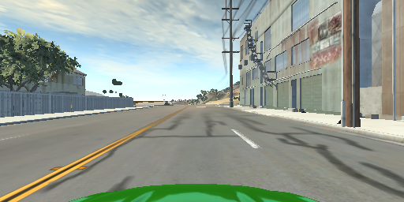

# NOTE
* **BNG_HOME** environmental variable pointing to **BeamNG.research.x64.exe** must be set.
* Parameters of projection
    * resolution = (512, 256) (w, h)
    * NEAR = 0.01
    * FAR = 1000
    * fov = 60
* example image


* sensor data (data.csv)
```python
columns = [
    'timestamp',
    'position_x',
    'position_y',
    'position_z',
    'direction_x',
    'direction_y',
    'direction_z',
    'velocity',
    'wheel_speed',
    'throttle',
    'brake',
    'steering'
]
```
